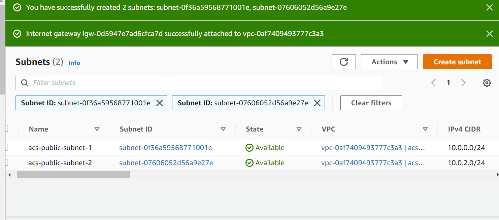
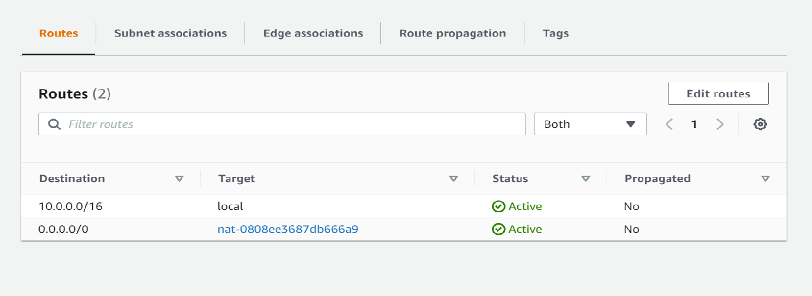

# AWS-Cloud-Solution-For-2-Websites-Using-A-Reverse-Proxy-Technology

## Set Up a Virtual Private Network (VPC)

Created a VPC

Created 2 public subnets and 4 private subnets 

Created a route table and associated it with public subnets

Create a route table and associate it with private subnets

Create an Internet Gateway

Associated public route tables with internet gateway

Created a NAT gateway with an elastic IP and associated with private subnets

created security groups for 

- Application load-balancers
- Bastion servers
- Nginx servers
- Webservers
- Data layer 

## TLS Certificates From Amazon Certificate Manager (ACM)

Requested a public wildcard certificate for the domain name

Validated the domain name using DNS

## Setting up EFS

Created an EFS filesystem

Created an EFS mount target per AZ in the VPC and associated it with both subnets dedicated for data layer

Associated the Security groups created earlier for data layer

Create an EFS access point. 

## Setting up RDS

Created a key for RDS with key management service 

Created and configured RDS

## Setting up compute resources

Created 3 ec2 instances to set up compute resouces 

Installed the following 
- python
- ntp
- net-tools
- vim
- wget
- telnet
- epel-release
- htop

Created AMIS for bastion, Nginx and webservers from the configured ec2 instances

## CONFIGURE APPLICATION LOAD BALANCER (ALB)

Created target groups for Nginx, tooling site and wordpress site

Created external application load balanacer

Forward traffic to nginx target 

Create internal load-balancer

Forward to tooling target and wordpress target

Created Launch templates

added below user data for nginx

added below user data for wordpress

added below user data for tooling

Created auto-scaling groups

## Databases 

Create database for tooling and wordpress 

ssh into bastion server

## Route53

Creates records

Confirm target groups are healthy 

Confirm Websites are fucntionioning 

